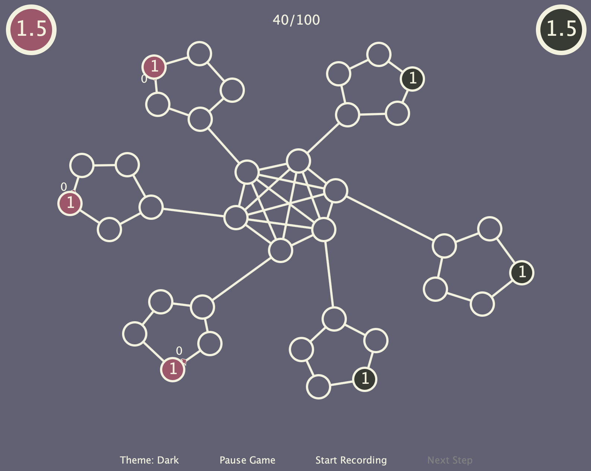

# Sharif-AI-Challenge
Sharif AI Challenge, 1st stage code for 2016 contest

Sharif AI Challenge is a programming competition for all who are interested in artificial intelligence.

This competition is held in two phases annually. Including an online and an on-site phase in which competitors will compete in teams of three in a game designed by our technical team.

The only pre-requisite to enter this competition is familiarity with programming using C++, Java or python. But obviously, knowledge of algorithmic thinking and artificial intelligence will be a great asset for any of the participating teams. You can find more details about this competition in this [Link](https://aichallenge.sharif.edu/)

In this repository, you can find our team's final submission in the final stage of this competition held in 2016 at Sharif University of Technology. We developed our AI program using Java programming language.


## How to run this program? 
In order to run this program, you need to run the game's server, and run two competitors. 

### Run the server: 
 You can run the server using: 
```{r, engine='bash', count_lines} 
java -jar flowsgameserver-v2.0.jar
```
after that you should choose an `.map` file that you want to run two competitors. There a few sample `.map` files given in this repository. Some of the are official `.map` files given by the competition. Our team also made some maps to test our code. After choosing a map, server starts and waits for two competitors to join the game. 



### Run a random client
A pre-compiled and simple random client that choose random actions on each turn is given in `FlowsRandomClient-v1.0.jar`. You can run this client using:
```{r, engine='bash', count_lines} 
java -jar FlowsRandomClient-v1.0.jar
```

### Run our code: 
You can run our compiled code using: 
```{r, engine='bash', count_lines} 
java -jar version3.5 - .jar
```
You can find the source code of the core of our code in `/src/client/AI.java`. 


## Author
* [**Amin Aghaee**](https://github.com/aminrd/) 
* [**Saeed Abedi Gozal Abad**](https://github.com/SirAbedi) 

